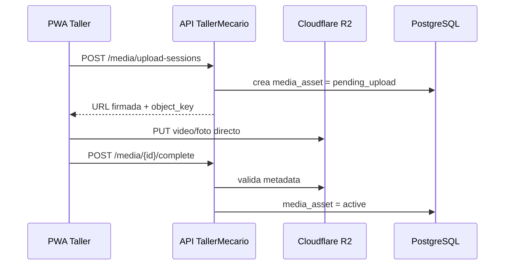

# Media directa a R2 y retención

Exportación seleccionada de Notion — 2026-09-30 (America/Bogota).

- Fuente: [🏗️ Arquitectura Técnica v1 — TallerMecario](https://app.notion.com/p/3de6ab0a330d817ab78bcbd88c100e5a?pvs=204) · última edición: 2026-09-28T14:28:04.864Z.
- Fuente: [🎥 ADR-003 — Media directa a Cloudflare R2 mediante URLs firmadas](https://app.notion.com/p/3e06ab0a330d810b95dfe7a163cfa782?pvs=204) · última edición: 2026-09-19T05:08:19.558Z.
- Fuente: [⚙️ Operación, Retención, Recuperación y Observabilidad v1 — TallerMecario](https://app.notion.com/p/3e06ab0a330d819ea376f6f7628679f6?pvs=204) · última edición: 2026-09-28T14:28:21.555Z.

Tipo: extracto fiel con formato Markdown normalizado. La selección no constituye un nuevo contrato HTTP ni demuestra implementación desplegada.

Las rutas de complete/upload de los diagramas son ilustrativas hasta contrastarlas con Track A. Consentimiento válido antes de iniciar captura; firmas de actos distintos requieren media distinta.

---

# 8. Arquitectura de archivos y video 360°
## Flujo de carga

### Estados de archivo
`pending_upload → uploaded → active → quarantined/deleted`
### Reglas
- Compresión de video en dispositivo cuando sea viable.
- Nunca almacenar blobs en PostgreSQL.
- `object_key` debe incluir un identificador interno del tenant, no datos personales visibles.
- Descargar mediante URLs firmadas de corta duración.
- Hash/checksum cuando el flujo lo permita.
- Reintentos de carga sin duplicar registros.
- Retención baseline: uploads incompletos 24 h; media operacional 12 meses tras orden terminal; media ligada a garantía conserva hasta el mayor entre ese plazo y `warranty_expires_at + 90 días`; firmas/PDF/evidencia de autorización-entrega 36 meses como default de producto.
- La política completa, legal hold, two-phase delete y purge R2 viven en [Operación, Retención, Recuperación y Observabilidad v1 — TallerMecario](https://app.notion.com/p/3e06ab0a330d819ea376f6f7628679f6).

**Decisión:** fotos/video360/documentos no atraviesan el backend como stream normal. El cliente carga directamente a R2 mediante una sesión y URL firmada emitida por ILVOX.

**Estado:** Aceptada  
**Fecha:** 2026-09-19
# Contexto
Video360 aumenta ancho de banda, memoria y costo si API actúa como proxy de binarios.
# Decisión
1. API crea `media_asset/upload_session` tenant-scoped.
2. API emite URL firmada temporal con límites esperados.
3. PWA carga directo a R2.
4. PWA confirma completion.
5. API valida metadata/objeto y activa asset.
6. Descargas usan acceso privado + URLs firmadas.
PostgreSQL almacena metadata; R2 almacena el binario.
# Seguridad
Object keys internos sin PII necesaria, bucket privado, MIME/tamaño allowlisted, expiración corta, tenant-safe media links y política de retención central.
# Consecuencias
Reduce carga del backend y costo de transferencia interna; exige lifecycle de upload, cleanup y reconciliación de objetos huérfanos.
# Quality Gate
Upload interrumpido/retry, archivo inválido, checksum/tamaño, URL expirada, cross-tenant y R2 outage.

## 2.2 Clases y defaults

| Clase/caso | Baseline | Inicio del reloj |
| --- | --- | --- |
| `pending_upload` / upload incompleto | 24 horas | creación/expiración de upload session |
| Objeto activo sin vínculo de dominio | 30 días | `uploaded_at` |
| `quarantined` sin incidente/hold | 7 días | quarantine |
| Fotos / video / video360 operacionales | 12 meses | orden `delivered` o `cancelled` |
| Media ligada a garantía | el mayor entre 12 meses post-orden y `warranty_expires_at + 90 días` | según regla |
| Firma, PDF de cotización, evidencia de autorización/entrega | 36 meses de producto | autorización/entrega/estado terminal correspondiente |

Los 12/36 meses son **defaults de producto**, no una afirmación de obligación legal colombiana. Antes de producción, la política contractual/legal puede ampliar o reducir cuando proceda.
## 2.3 Reglas de cálculo
- `retention_until` se determina server-side al asociar/cerrar el recurso.
- Si un asset tiene múltiples vínculos, aplica la fecha de retención **más larga**.
- `legal_hold_until`, disputa, incidente o DSR en investigación suspende el purge automático.
- Cambiar un plan nunca acorta retroactivamente una evidencia ya comprometida por garantía/hold.
- Para órdenes no terminales, no se inicia todavía el TTL operativo.

