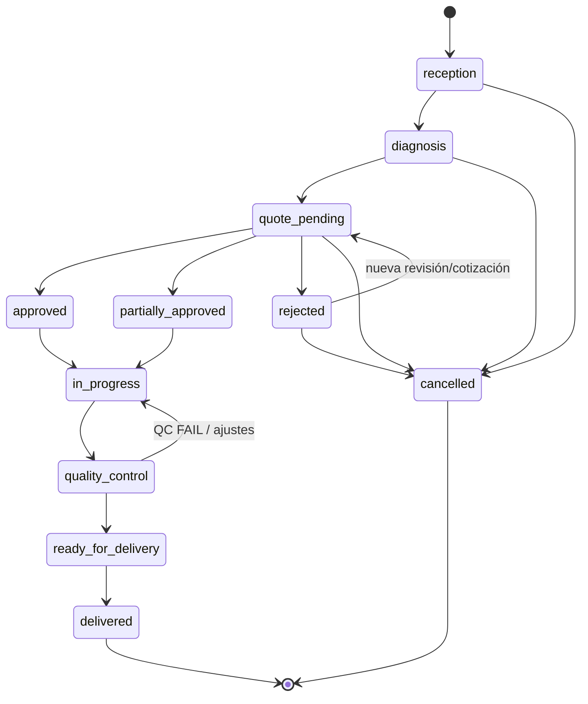
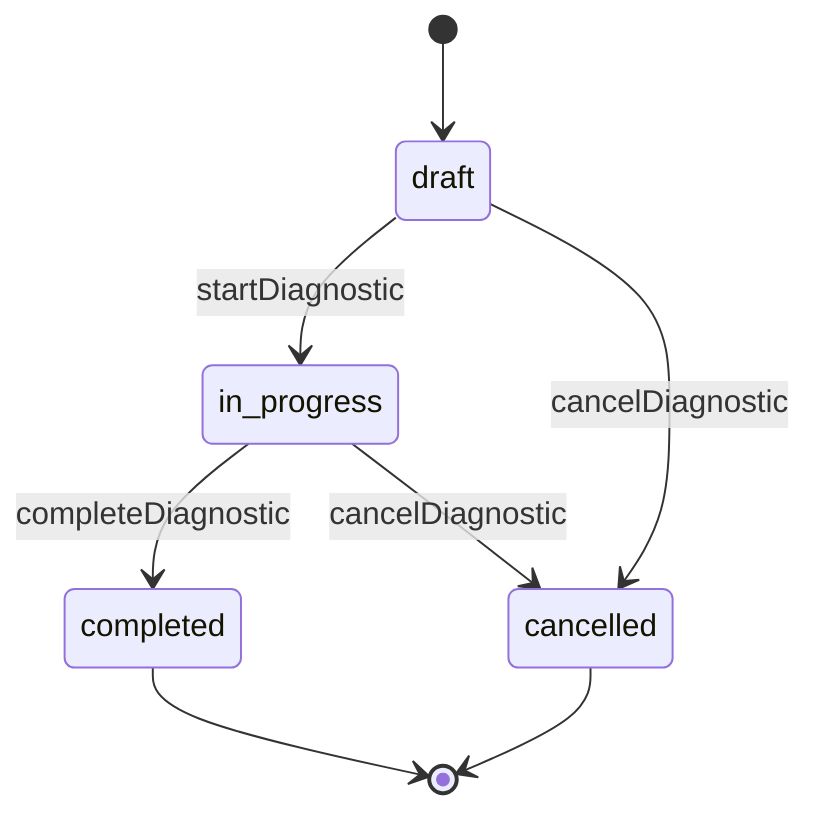
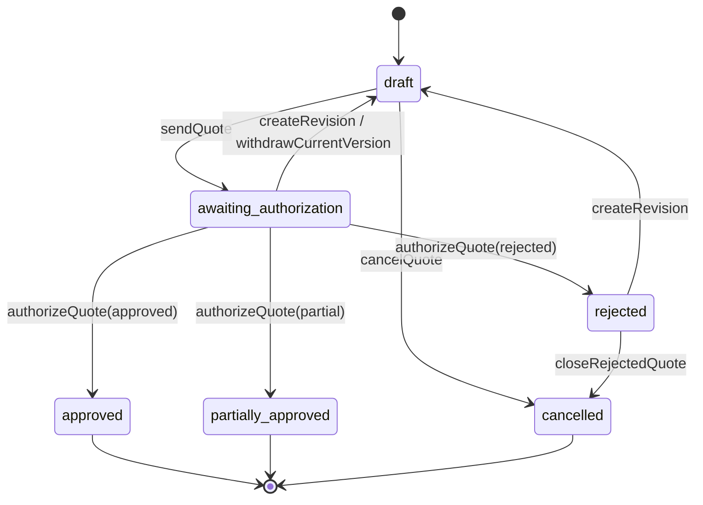
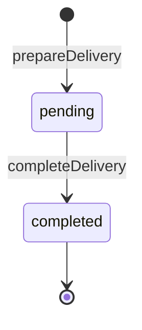
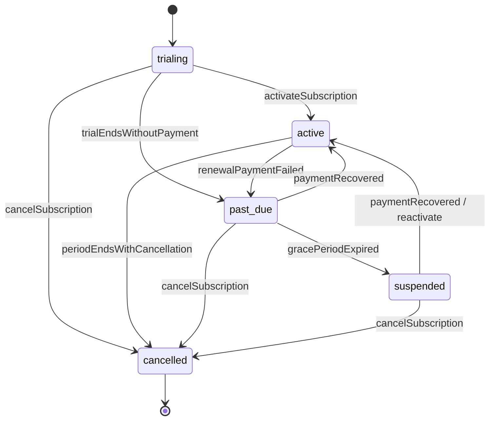
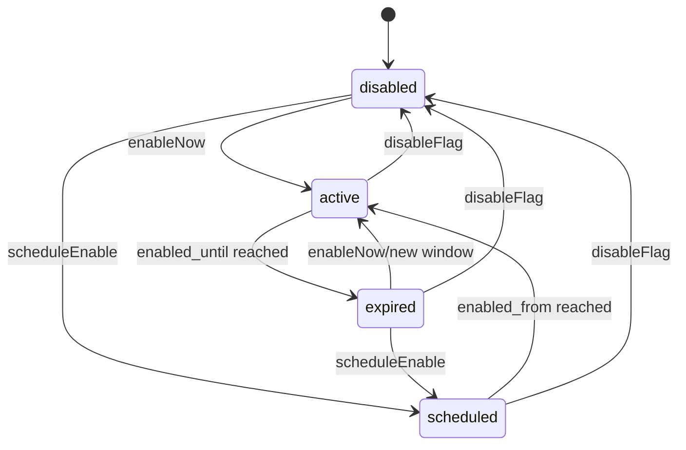

# Estados y transiciones por dominio

Exportación seleccionada de Notion — 2026-09-30 (America/Bogota).

- Fuente: [🔄 Estados y Transiciones por Dominio v1](https://app.notion.com/p/3e06ab0a330d819080edfe450a75a7f5?pvs=204) · última edición: 2026-09-19T17:43:13.530Z.

Tipo: extracto fiel con formato Markdown normalizado. La selección no constituye un nuevo contrato HTTP ni demuestra implementación desplegada.

La API ejecuta comandos y revalida guards. El frontend representa estados/acciones; no persiste status arbitrario. Las referencias a lifecycle de memberships se completan con api/memberships.md; ver OPEN-QUESTIONS.

---

**Objetivo:** definir las máquinas de estado canónicas de los dominios con lifecycle propio. Ningún `status` de negocio se modifica mediante PATCH genérico; toda transición se ejecuta mediante un comando de dominio con autorización, guards, auditoría y efectos atómicos.

**Estado:** Baseline documental v1 — Sprint 0  
**Fuente de verdad:** este documento + ERD.  
**Dominios:** service_orders, diagnostics, quotes, deliveries, subscriptions y feature_flags.

# 1. Reglas transversales
- El cliente nunca envía un `status` arbitrario que la API persista directamente.
- Cada transición tiene un comando explícito (`startDiagnostic`, `sendQuote`, `completeDelivery`, etc.).
- El servidor valida estado origen, RBAC, tenant, recurso y precondiciones antes de mutar.
- Una transición inválida devuelve error de dominio estable y no produce efectos parciales.
- Cuando una transición genera registros históricos/outbox/auditoría, todo ocurre en la misma transacción PostgreSQL cuando sea posible.
- Estados terminales no regresan a estados anteriores salvo transición expresamente documentada.
- Cambios relevantes se auditan; históricos append-only no se reescriben.
- Webhooks externos pueden **solicitar/reconciliar** una transición, pero nunca saltan validación de firma, idempotencia ni reglas del dominio.
# 2. Service Orders — referencia canónica
Estados:
`reception | diagnosis | quote_pending | approved | partially_approved | rejected | in_progress | quality_control | ready_for_delivery | delivered | cancelled`

Esta máquina ya estaba definida; se conserva como lifecycle principal de la orden.
# 3. Diagnostics
## Estados
`draft | in_progress | completed | cancelled`

## Comandos y guards

| Comando | Origen | Destino | Precondiciones principales |
| --- | --- | --- | --- |
| `startDiagnostic` | draft | in_progress | Orden del mismo tenant en fase compatible; actor con `diagnostics.write`; si es técnico, asignación activa. |
| `completeDiagnostic` | in_progress | completed | Actor autorizado; `summary` válido; findings/recommendations consistentes; fija `completed_at`. |
| `cancelDiagnostic` | draft/in_progress | cancelled | Motivo obligatorio; no puede cancelar uno ya completado. |

Reglas:
- `completed` y `cancelled` son terminales en MVP.
- Si aparece nueva información después de completar, se crea un **nuevo diagnóstico** asociado a la misma orden; no se reescribe el anterior.
- Máximo un diagnóstico activo (`draft/in_progress`) por orden en MVP.
- Completar diagnóstico puede habilitar el paso de la orden hacia `quote_pending` cuando se satisfagan las reglas de la orden; no se cambia la orden por escribir el campo directamente.
# 4. Quotes
## Estados
`draft | awaiting_authorization | approved | partially_approved | rejected | cancelled`

## Reglas de versión
- `quote_versions` contiene el contenido versionado.
- Una versión enviada queda **inmutable en contenido**.
- `current_version_id` identifica la única versión vigente del contenedor.
- `sendQuote` solo puede enviar la versión actual y fija `sent_at`.
- El token de autorización vive en `quote_authorization_tokens` y siempre referencia una versión exacta.
- Si se crea una revisión mientras la cotización espera autorización, la versión anterior permanece histórica, el quote vuelve a `draft` y todos sus `quote_authorization_tokens` activos pasan a `superseded`.
- `quote_authorizations` conserva append-only la decisión sobre la versión exacta anterior.
- Después de `approved` o `partially_approved`, esa cotización queda terminal. Ajustes posteriores requieren una nueva cotización `quote_type='supplemental'`; no se altera la autorización original.
- Una cotización supplemental puede crearse mientras la orden está `in_progress` (y después de un QC fallido cuando volvió a `in_progress`). Su lifecycle de quote es el mismo, pero **no** devuelve la orden completa a `quote_pending`.
- Si una supplemental es aprobada/parcialmente aprobada, solo materializa las nuevas líneas autorizadas en `service_order_items` y la orden permanece `in_progress`; si es rechazada/cancelled, la orden también permanece `in_progress`.
## Comandos y guards

| Comando | Origen | Destino | Precondiciones principales |
| --- | --- | --- | --- |
| `sendQuote` | draft | awaiting_authorization | Versión actual válida, ≥1 línea, totales consistentes, actor `quotes.send`. Para supplemental, orden en `in_progress` y líneas permitidas por el ajuste. |
| `proposeLaborAdjustment` | no quote | draft supplemental | Actor `quotes.propose_labor_adjustment`; si es technician, assignment técnico activo en la orden; orden `in_progress`; crea únicamente líneas `labor`; no envía ni autoriza. |
| `createRevision` | awaiting_authorization/rejected | draft | Crea nueva `quote_version`; nunca edita versión enviada; invalida uso futuro del token anterior por no ser current version. |
| `authorizeQuote` | awaiting_authorization | approved/partially_approved/rejected | Flujo público: `quote_authorization_token` activo/no expirado/current + `quote_authorization_challenge` OTP `verified` vigente del mismo token; decisión/line items coherentes. Consumir challenge + token + crear autorización + superseder tokens hermanos es atómico e idempotente. Para quote `initial`, coordina la transición normal quote/order; para `supplemental`, materializa solo líneas nuevas autorizadas y conserva la orden `in_progress`. Flujo manual: actor interno con permiso, sin token/challenge ficticio. |
| `cancelQuote` | draft | cancelled | Actor autorizado; motivo. |
| `closeRejectedQuote` | rejected | cancelled | Actor autorizado; no habrá revisión. |

# 5. Deliveries
## Estados
`pending | completed`

Se mantiene **una entrega por orden** (`UNIQUE tenant/order`). No existe `cancelled` en MVP: si el cliente no retira el vehículo o el intento se aplaza, la entrega permanece `pending`. Esto evita crear estados terminales que choquen con la unicidad de una sola entrega.
## Comandos y guards

| Comando | Origen | Destino | Precondiciones principales |
| --- | --- | --- | --- |
| `prepareDelivery` | no record | pending | Orden `ready_for_delivery`; mismo tenant; actor `deliveries.complete` o permiso operativo correspondiente. |
| `completeDelivery` | pending | completed | Orden aún `ready_for_delivery`; datos de receptor válidos; firma/evidencia según política; resumen final consistente; fija `delivered_at` y transiciona orden a `delivered` atómicamente. |

Reglas:
- `completed` es terminal.
- `payment_status` y `outstanding_balance` siguen derivados del ledger; no son estados de esta máquina.
- Un saldo pendiente no bloquea automáticamente la entrega en baseline; una política futura del taller podría añadir ese guard mediante ADR/regla explícita.
- Si `completeDelivery` falla, la orden no puede quedar `delivered` parcialmente.
# 6. Subscriptions SaaS
## Estados
`trialing | active | past_due | suspended | cancelled`

## Reglas
- `cancel_at_period_end=true` **no es un estado**: una suscripción puede seguir `active` hasta `current_period_end`; al llegar la fecha pasa a `cancelled` si la cancelación sigue programada.
- `past_due` representa deuda/fallo de renovación durante gracia; no elimina datos operativos.
- `suspended` bloquea entitlements definidos por política, pero nunca borra información.
- `cancelled` es terminal para ese registro. Una contratación posterior crea una nueva suscripción o flujo explícito futuro; no se reescribe el histórico cancelado.
- Webhooks Wompi/provider solo producen transición tras firma válida, idempotencia y conciliación.
- `billing_events` conserva la evidencia append-only de los eventos que originan/reconcilian cambios.
## Comandos/eventos principales

| Comando/evento | Transición | Guard |
| --- | --- | --- |
| `activateSubscription` | trialing → active | Pago/condición de activación confirmada. |
| `renewalPaymentFailed` | active → past_due | Evento verificado o reconciliación. |
| `paymentRecovered` | past_due/suspended → active | Pago confirmado y período reconciliado. |
| `gracePeriodExpired` | past_due → suspended | `grace_until <= now()` y deuda no resuelta. |
| `scheduleCancellation` | active → active | Solo cambia `cancel_at_period_end`; no falsea status. |
| `periodEndsWithCancellation` | active → cancelled | Fin de período y cancelación programada. |
| `cancelSubscription` | trialing/past_due/suspended → cancelled | Política/actor autorizado; no borra datos. |

# 7. Feature Flags
`feature_flags` **no tendrá un ****`status`**** persistido**. El estado efectivo se deriva para evitar inconsistencias con `enabled`, `enabled_from` y `enabled_until`.
## Estados efectivos derivados
`disabled | scheduled | active | expired`
Reglas de derivación:
```text
if enabled = false
  → disabled
else if enabled_from IS NOT NULL AND now < enabled_from
  → scheduled
else if enabled_until IS NOT NULL AND now >= enabled_until
  → expired
else
  → active
```

## Comandos y reglas
- `enableNow`: `enabled=true`, ventana válida y comienzo inmediato.
- `scheduleEnable`: `enabled=true`, `enabled_from` futuro y `enabled_until` opcional posterior.
- `disableFlag`: `enabled=false`; la ventana histórica/configurada puede conservarse según implementación, pero el estado efectivo es disabled.
- `updateWindow`: solo permite `enabled_until > enabled_from` cuando ambas existen.
- `enabled_until <= enabled_from` es inválido.
- Resolución por alcance baseline: **tenant \> plan \> global \> default de código**.
- Se evalúan candidatos desde el scope más específico al menos específico.
- `enabled=false` es un **override explícito OFF** y detiene la resolución: no cae al scope inferior.
- Una fila `scheduled` todavía no aplica; mientras no llegue `enabled_from`, se continúa al siguiente scope.
- Una fila `expired` ya no aplica; después de `enabled_until`, se continúa al siguiente scope.
- Una fila `active` aplica y devuelve su configuración/valor.
- Si ningún scope aplica, se usa el default de código.
- Los cambios de flags sensibles se auditan con actor, scope, feature_key, before/after y request_id.
- El frontend puede ocultar features, pero el backend vuelve a comprobar entitlement/flag antes de ejecutar la capacidad protegida.
# 8. Consistencia entre dominios
- `diagnostic.completed` puede habilitar `service_order: diagnosis → quote_pending`; no debe hacerlo si existen guards pendientes.
- `quote.approved/partially_approved/rejected` alimenta la transición correspondiente de `service_orders` mediante comando coordinado.
- Si una cotización rechazada se revisa, `quote: rejected → draft` debe coordinar `service_order: rejected → quote_pending`; la autorización rechazada anterior permanece histórica.
- `delivery.completed` y `service_order.delivered` deben confirmarse en la misma transacción.
- `subscription.status` determina entitlements SaaS; nunca consulta al proveedor externo en cada request.
- `feature_flags` modifica disponibilidad de capacidades, pero **no sustituye RBAC**.
# 9. Errores de transición
Contrato sugerido:
```text
409 DOMAIN_INVALID_STATE_TRANSITION
403 DOMAIN_ACTION_FORBIDDEN
422 DOMAIN_PRECONDITION_FAILED
```
La respuesta segura puede incluir `current_state`, `requested_action` y `request_id`, pero no detalles internos sensibles.
# 10. Quality Gate
- [ ] Cada dominio solo acepta estados definidos.
- [ ] Cada transición válida tiene test positivo.
- [ ] Cada transición prohibida tiene test negativo.
- [ ] No existe endpoint genérico que permita escribir `status` arbitrario.
- [ ] Concurrencia no permite ejecutar dos transiciones incompatibles desde el mismo estado.
- [ ] Transición y efectos históricos/outbox relacionados son atómicos.
- [ ] Diagnostics completed/cancelled no se reabren; re-diagnóstico crea nuevo registro.
- [ ] Quote enviada conserva versión inmutable y autorización solo acepta current version.
- [ ] `quote_authorization_tokens` existe antes de la decisión y separa lifecycle de credencial vs evidencia final.
- [ ] En flujo público, `quote_authorization_challenges` exige OTP verificado vigente antes de ejecutar `authorizeQuote`; consultar la cotización no consume token ni challenge.
- [ ] Un token consumido solo genera una autorización; tokens hermanos activos quedan superseded en la misma transacción.
- [ ] Revisión de quote supersede tokens activos de la versión anterior.
- [ ] Revision invalida autorización futura de versión anterior sin borrar su historia.
- [ ] Delivery completed y order delivered quedan consistentes atómicamente.
- [ ] Subscription no borra datos al entrar en past_due/suspended/cancelled.
- [ ] Webhook duplicado no repite transición de subscription.
- [ ] Feature flag efectivo coincide con enabled/ventana y precedence tenant \> plan \> global.
- [ ] Override `enabled=false` bloquea scopes inferiores; flags `scheduled/expired` caen al siguiente scope aplicable.
- [ ] Feature flag deshabilitado en frontend también queda bloqueado/omitido en backend cuando aplique.
El Gate debe probar **acciones**, no solo que el campo `status` tenga un CHECK. Una máquina de estados existe cuando el sistema impide transiciones inválidas bajo concurrencia y conserva evidencia de las válidas.

